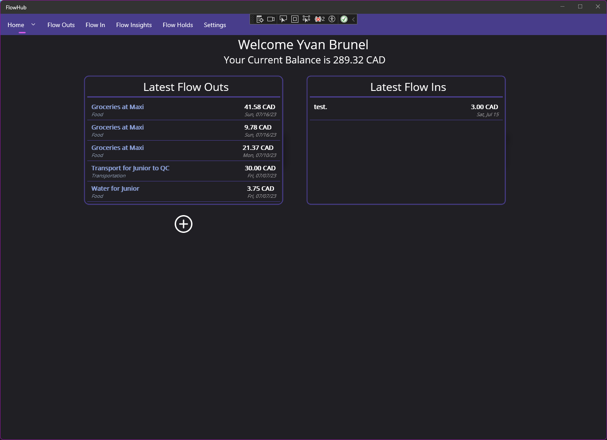

Time Spent So Far... 
# FlowHub (An Expense Tracker) Cross Platform MAUI App (Will RESUME DEV AS SOON AS .NET 8 DROPS)

An Application used to manage Savings, Expenditures, Incomes, Debts, Financial plannings etc.

Ideal for anyone who likes to keep track of their Financial Flow.

## Screenshots at bottom of the page

## More [Here... 📸](https://github.com/YBTopaz8/FlowHub-MAUI/tree/master/ScreenShots)
## Requirements
This project is build on .NET CORE 7, .NET MAUI and LiteDB as its DataBase using iText 7 for PDF Generation.

The Requirement to run use THIS project, you would need;
- A PC running Windows 10 at least.
- An Android Device running Android 11 at least (API 30).
- Visual Studio 2019, 2022 or latest (It was built on VS 2022) with MAUI support.

## Installation
To install the project, please do as follows;
- Clone the project from my GitHub
- Extract the project to your desired location
- Load it in Visual Studio
- Open the Package Manager Console (View -> Other Windows -> Package Manager Console)
- Type 'dotnet restore' without the ' '  then press Enter. 
- Wait for it to restore all required packages

> Then,
- Ensure you have an Android Virtual Device for emulation testing.
- Make sure you have Hardware Acceleration enabled on your PC
Build and run your app and that's it!

## FAQ:

| CodeName      | UI Name       |
| ------------- |:-------------:|
| Expenditure   | Flow Out      |
| Income        | Flow In       |
| Debt        | Flow Hold       |

## Currently Existing Features

- Official Android and Windows Beta Versions
- Expenditures Management (CRUD operations)
- Income Management (CRUD Operations)
- Debts Management now :D
- Black and White Themes
- Statistics and Graphs
- Report Printing for Flow Outs on both Windows and Android
- Login feature and Account Management.
- Support for probably all currencies 
> More Coming Soon...

## Roadmap (Upcoming features)
- Normal Planned Expenditures
- Application Customisation
- Localization for Multilanguage 

## Screenshots
## Login/Register Android
| Android Light Mode| Android Dark Mode| 
| ------------- |:-------------:|
|    | | 
|         |       |

## General UI Android
| Android Light Mode| Android Dark Mode| 
| ------------- |:-------------:|
| | |
|  | |
| | |

## Login/Register Windows
| Windows Light Mode| Windows Dark Mode| 
| ------------- |:-------------:|
|    | | 
|    | | 

## GENERAL UI Windows
| Windows Light Mode| Windows Dark Mode| 
| ------------- |:-------------:|
| |  |
|  | |

> Those are just the surfaces..

## Lots and Lots of thanks to:
- [enisn](https://github.com/enisn) for their incredible [UraniumUI](https://github.com/enisn/UraniumUI) and [InputKit](https://github.com/enisn/Xamarin.Forms.InputKit) That I HEAVILY use in this project ❤️
- [Beto Rodriguez](https://github.com/beto-rodriguez) for the charts & graph library : [LiveCharts2](https://github.com/beto-rodriguez/LiveCharts2)

## Authors

- [Yvan Brunel](https://github.com/YBTopaz8) (Author)
- [Silver](https://github.com/Silver-U) (Co-Author)

 [My Simple Portfolio](https://flowcv.me/ybtopaz)

